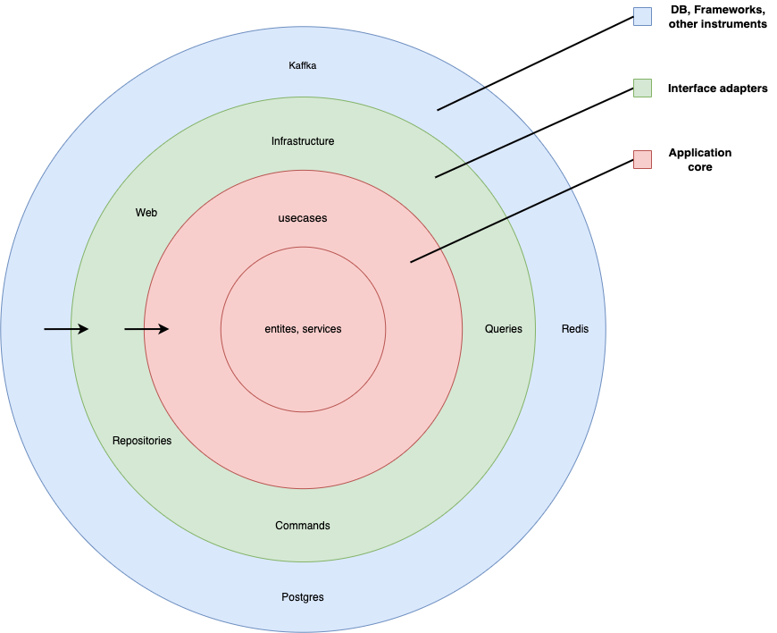

# The Clean Architecture template for go backend app

## The template schema



## Dependency rule

The template uses an approach [Clean architecture](https://blog.cleancoder.com/uncle-bob/2012/08/13/the-clean-architecture.html).

## How to use
You need to install [cookiecutter](https://github.com/cookiecutter/cookiecutter) for using this template  

Some examples:

```zsh
cookiecutter -f https://github.com/VitalyDubovets/backend-go-template-clean-architecture.git
cookiecutter -f git@github.com:VitalyDubovets/backend-go-template-clean-architecture.git
```

##  Stack technology
I added some external packages for a pleasant creating your service

External packages:

- OpenTelemetry
- Zap
- Jaeger
- Sentry-sdk
- caarlos0/env/v8

##### You also can add your own dependencies


## A linter
The main linter's GolangCI-Lint

```zsh
golangci-lint run
```